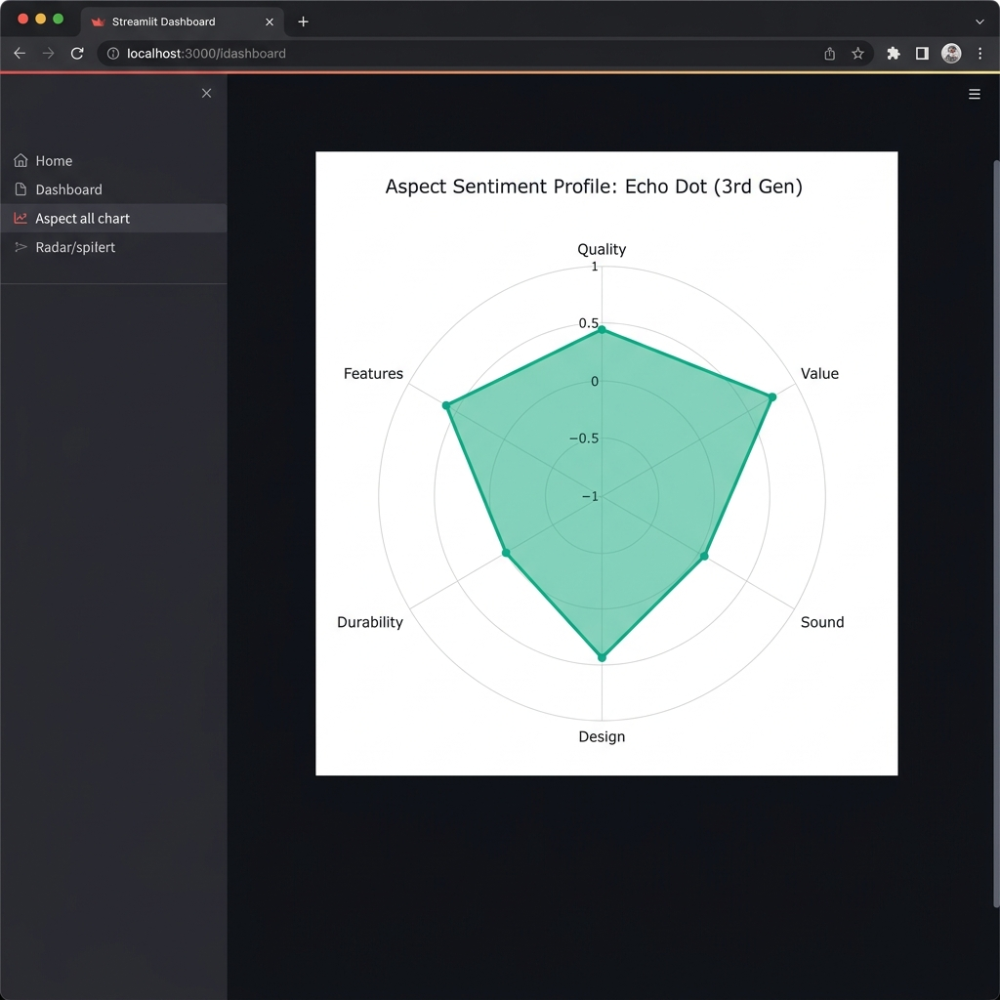
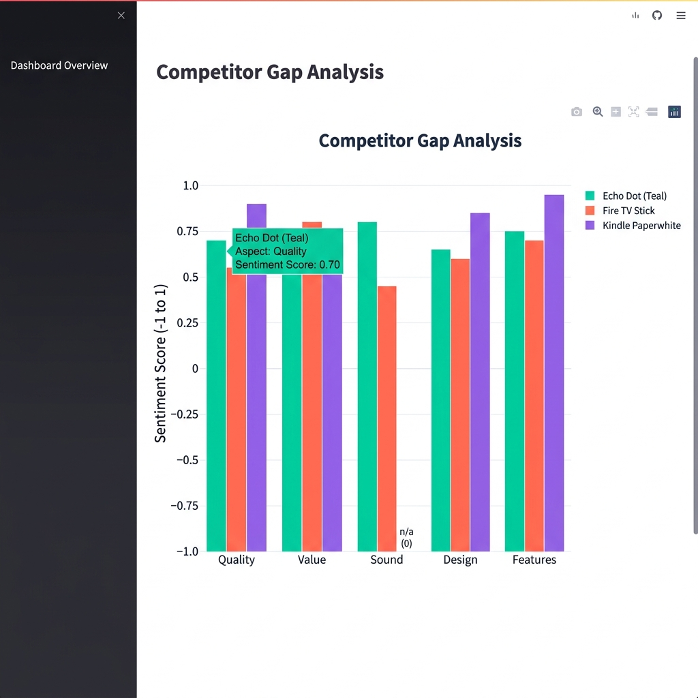
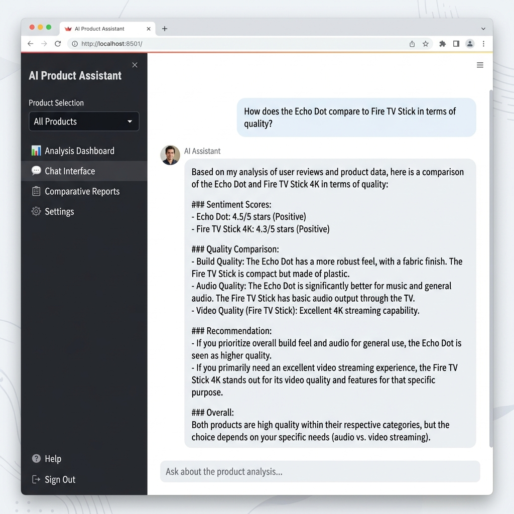

# Amazon Product Analysis

    

> NLP pipeline that transforms Amazon product reviews into sentiment scores, rating predictions, and category-level business insights.

## 🚀 Live Demo

**[Try the app on Hugging Face Spaces →](https://huggingface.co/spaces/shahidbaig2/amazondata_project)**

---

## Overview

Customer reviews are one of the richest — and most underutilized — signals in e-commerce. This project processes Amazon product review data through a full NLP pipeline: sentiment classification, star-rating prediction, and aggregated category-level insights. A Streamlit dashboard and a chat interface (`chat.py`) allow business users to query insights without writing code.

## Features

### 📊 Aspect Sentiment Radar Chart

Interactive Plotly radar chart that maps sentiment scores across multiple product dimensions — quality, value, sound, design, durability, and features — letting you instantly spot a product's strengths and weaknesses.



### 📈 Competitor Gap Analysis

Side-by-side grouped bar chart comparing multiple Amazon products across the same sentiment dimensions. Instantly visualize competitive positioning and identify where each product leads or lags.



### 🤖 AI Chat Interface (RAG + Google Gemini)

A conversational AI assistant powered by Google Gemini with RAG (Retrieval-Augmented Generation). Ask natural language questions about product performance, and the AI retrieves relevant data from the analysis to generate grounded, data-backed responses — no hallucinated numbers.



---

## Tech Stack

| Layer | Technology |
|-------|-----------|
| **Frontend** | Streamlit |
| **Visualizations** | Plotly (`go.Scatterpolar`, `px.bar`) |
| **Data Processing** | Pandas |
| **AI / LLM** | Google Gemini (via `google-generativeai`) |
| **Architecture** | RAG (Retrieval-Augmented Generation) |
| **Deployment** | Hugging Face Spaces |

## Project Structure

```
amazon-product-analysis/
├── app.py              # Main Streamlit dashboard
├── visuals.py          # Plotly visualizations (radar chart + competitor gap)
├── chat.py             # RAG chat interface using Google Gemini
├── insights.json       # Pre-processed NLP pipeline output
├── requirements.txt    # Python dependencies
├── assets/             # Screenshots and images
│   ├── radar_chart.png
│   ├── competitor_gap.png
│   └── chatbot.png
└── README.md
```

## How It Works

```
Amazon Reviews → NLP Pipeline → insights.json → Streamlit Dashboard
                                                      │
                                    ┌─────────────────┼─────────────────┐
                                    ▼                 ▼                 ▼
                              Radar Chart     Competitor Gap      AI Chatbot
                              (visuals.py)    (visuals.py)       (chat.py)
                                                                     │
                                                              retrieve_context()
                                                                     │
                                                              Google Gemini API
                                                                     │
                                                              Grounded Response
```

1. **Data Processing**: Raw Amazon review data is processed through an NLP pipeline to extract aspect-level sentiment scores
2. **Visualization**: Interactive Plotly charts render sentiment profiles and competitive comparisons
3. **AI Assistant**: A RAG-powered chatbot retrieves relevant product data and generates contextual, grounded responses via Google Gemini

## Quick Start

```bash
# Clone the repository
git clone https://github.com/shahidbaig-shaik/amazon-product-analysis.git
cd amazon-product-analysis

# Install dependencies
pip install -r requirements.txt

# Set your Google API key (for the chatbot)
export GOOGLE_API_KEY="your_api_key_here"

# Run the app
streamlit run app.py
```

## Key Technical Highlights

- **RAG Architecture**: The chatbot doesn't just call an LLM blindly — it first retrieves relevant product data via `retrieve_context()`, then sends that data as grounded context to Gemini. This prevents hallucination and ensures every insight is backed by real data.
- **Interactive Plotly Charts**: Radar charts use `go.Scatterpolar` with custom hover templates for detailed drill-down. Competitor gap charts use grouped bars for side-by-side comparison.
- **Dynamic Model Discovery**: The chat interface automatically discovers supported Gemini models via `genai.list_models()`, ensuring compatibility across API versions.

## License

MIT
